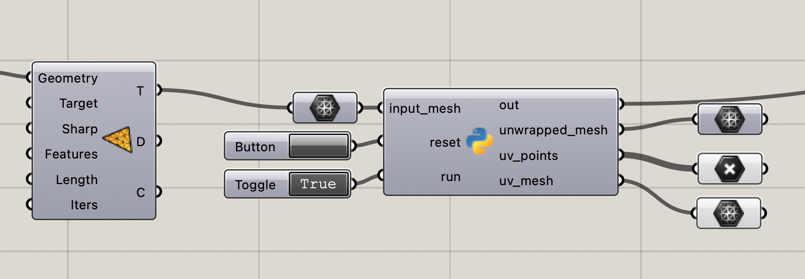

# Grasshopper-LSCM-unwrapper-uv

Grasshopper LSCM纹理映射脚本
**通过deepseek生成实现。**
**适用于Mac和Windows**

## Grasshopper 组件设置

| 输入参数         | 类型    | 设置                                                           |
| ------------------ | --------- | ---------------------------------------------------------------- |
| `input_mesh` | Mesh    | 连接你的网格数据                                               |
| `run`        | Boolean | 使用 **Boolean Toggle**                                  |
| `reset`      | Boolean | 使用 **Button**      |
| **输出**       |         |                      |
| `unwrapped_mesh` | Mesh    | 带有UV坐标的原始网格 |
| `uv_points`      | Point3d | UV坐标点云           |
| `uv_mesh`        | Mesh    | UV空间的平面网格     |

