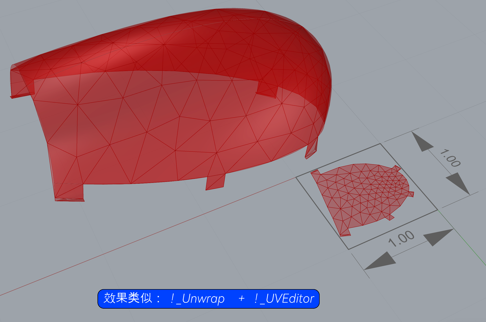
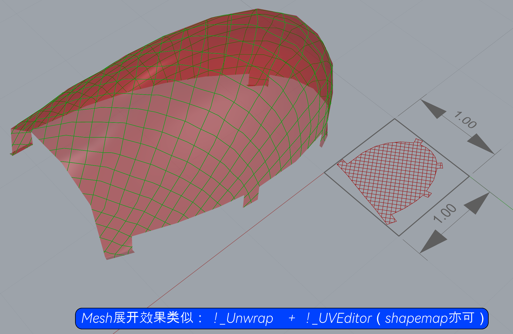
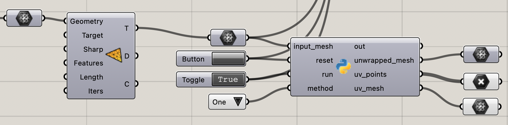
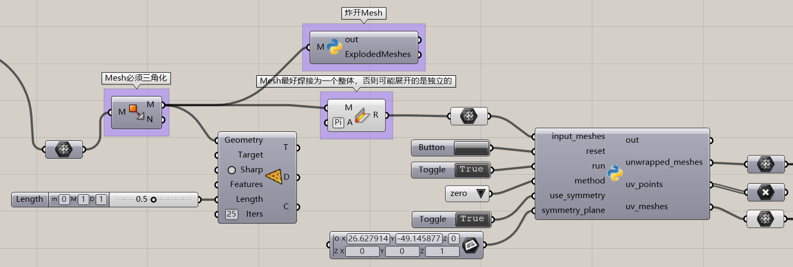

# Grasshopper-LSCM-unwrapper-uv
-----
Grasshopper LSCM纹理映射脚本 for python  
**通过deepseek生成实现。**  
**适用于Mac和Windows**  
**适用版本：Rhino8**  
**适用版本：Rhino8**  
-----
*这个程序是创建和shapemap类似的效果，目的是给用户创建纹理映射所需的展开图. 
如果您会使用`Mesh`中的`Mesh Closest Point`和`Mesh Eval`命令(或者是`kangaroo2`中的`MeshMap`)，那么您将创建和shapemap类似的效果。 
如果你使用的是windows系统，更推荐您使用Rhino官方插件[shapemap](https://www.food4rhino.com/en/app/shapemap)（点击下载），当然，如果你使用的是Mac系统，就可以使用此程序。*

>**点击下载:[`GH_Files/Rhino8_GH_unwrap_uv_texture_pro.gh`]([https://github.com/zhang1394725324/Grasshopper-LSCM-unwrapper-uv/blob/main/GH_Files/Rhino8_GH_unwrap_uv_texture_pro.gh](https://raw.githubusercontent.com/zhang1394725324/Grasshopper-LSCM-unwrapper-uv/refs/heads/main/GH_Files/Rhino8_GH_unwrap_uv_texture_pro.gh))**

-----
## Grasshopper 组件设置(GH_LSCM.py)

| 输入参数         | 类型    | 设置                                                           |
| ------------------ | --------- | ---------------------------------------------------------------- |
| `input_mesh` | Mesh    | 连接你的网格数据                                               |
| `run`        | Boolean | 使用 **Boolean Toggle**                                  |
| `reset`      | Boolean | 使用 **Button**      |
| **输出**       |         |                      |
| `unwrapped_mesh` | Mesh    | 带有UV坐标的原始网格 |
| `uv_points`      | Point3d | UV坐标点云           |
| `uv_mesh`        | Mesh    | UV空间的平面网格     |

-----
## Grasshopper 设置(GH_UV_unwrapp.py)

| 输入参数         | 类型    | 说明     | 设置                                             |
| ------------------ | --------- | ---------- | -------------------------------------------------- |
| `input_mesh` | Mesh    | 输入网格 | 连接你的网格                                     |
| `run`        | Boolean | 运行控制 | **Boolean Toggle**                         |
| `reset`      | Boolean | 复位按钮 | **Button**                                 |
| `method`     | Integer | 方法选择 | **Integer Slider** 或 **Value List** |
| **输出**       |         |                      |
| `unwrapped_mesh` | Mesh    | 带有UV坐标的原始网格 |
| `uv_points`      | Point3d | UV坐标点云           |
| `uv_mesh`        | Mesh    | UV空间的平面网格     |

1. ### 推荐的 Value List 设置
   
   在 Grasshopper 中为 `method` 输入添加 **Value List**：

| 名称  | 值 | 说明                        |
| ----- | -- | --------------------------- |
| LSCM  | 0  | 最小二乘共形映射 (最均衡)   |
| ABF++ | 1  | 基于角度的展平 (保角性好)   |
| ARAP  | 2  | 尽可能刚性的展平 (保面积好) |

2. ### 三种方法的特点对比

| 方法      | 特点                               | 适用场景                   |
| --------- | ---------------------------------- | -------------------------- |
| **LSCM**  | 最小二乘共形映射，平衡保角性和拉伸 | 一般用途，最常用           |
| **ABF++** | 基于角度的展平，保角性最好         | 需要保持形状的纹理映射     |
| **ARAP**  | 尽可能刚性，保面积好               | 减少面积变形，适合物理模拟 |

## Grasshopper 设置(GH_UV_unwrapp_pro.py)
### 输入参数 (Inputs)

| 参数名               | 类型访问 | 数据格式 | 说明             |
| ---------------------- | ---------- | ---------- | ------------------ |
| `input_mesh`     | Mesh     | Item     | 要展开的原始网格 |
| `run`            | Boolean  | Item     | 运行控制开关     |
| `reset`          | Boolean  | Item     | 复位按钮         |
| `method`         | Integer  | Item     | 展开方法 (0/1/2) |
| `use_symmetry`   | Boolean  | Item     | 是否启用对称     |
| `symmetry_plane` | Plane    | Item     | 对称平面（可选） |

### 输出参数 (Outputs)

| 参数名               | 类型访问 | 说明                 |
| ---------------------- | ---------- | ---------------------- |
| `unwrapped_mesh` | Mesh     | 带有UV坐标的原始网格 |
| `uv_points`      | Point3d  | UV坐标点云           |
| `uv_mesh`        | Mesh     | UV空间的平面网格     |

